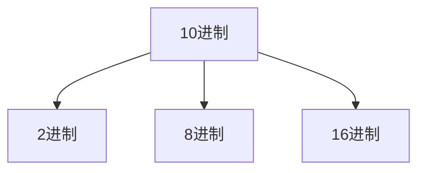

---
{"dg-publish":true,"permalink":"/Md Files/10进制-->其他进制/","dgPassFrontmatter":true}
---

- [[Md Files/二进制\|二进制]]
- [[Md Files/其他进制-->10进制\|其他进制-->10进制]] 
- [[Md Files/10进制-->其他进制\|10进制-->其他进制]]  
- [[Md Files/2进制-->其他进制\|2进制-->其他进制]] 
- [[Md Files/8进制16进制-->转2进制\|8进制16进制-->转2进制]] 
- [[Md Files/运算符\|返回]]  
---

---
#### 10进制转2进制
- 将该数不断除以2，直到商为0为止，然后将每步得到的余数倒过来，就是对应的2进制
- **案例**：`34`转换为`2进制`为`0b100010`-->`0b00100010`(一个字节有8位)
$$\begin{bmatrix}
除数 & 被除数 & 余数\\
2 & 34 & 0\\
2 & 17 & 1\\
2 & 8  & 0\\
2 & 4  & 0\\
2 & 2  & 0\\
  & 1  & \\
\end{bmatrix}$$
- -- 
#### 10进制转8进制
- 案例：`131`转`8进制`-->`0203` 
$$\begin{bmatrix}
除数 & 被除数 & 余数\\
8 & 131 & 3\\
8 & 16  & 0\\
  & 2  & \\

\end{bmatrix}$$
---
#### 10进制转16进制
- 案例：`237`转`16进制`-->`0xED` 
$$\begin{bmatrix}
除数 & 被除数 & 余数\\
16 & 237 & 13(D)\\
 & 14(E)  & \\
\end{bmatrix}$$
