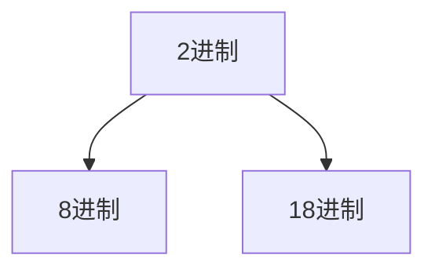

---
{"dg-publish":true,"permalink":"/md-files/2/","dgPassFrontmatter":true}
---

- [[Md Files/二进制\|二进制]]  
- [[Md Files/其他进制-->10进制\|其他进制-->10进制]] 
- [[Md Files/10进制-->其他进制\|10进制-->其他进制]]  
- [[Md Files/2进制-->其他进制\|2进制-->其他进制]] 
- [[Md Files/8进制16进制-->转2进制\|8进制16进制-->转2进制]] 
- [[Md Files/运算符\|返回]]  
- ---

---
#### 2进制转8进制
- 从最低位开始，将2进制数`每三位一组`，转成对应的8进制数
- 案例：`0b11010101`转`8进制` 
	- 0b011010101 --> `0325`
		- 001：$0\times2^2+1\times2^1+1\times2^0=3$ 
		- 010：$0\times2^2+1\times2^1+0\times2^0=2$ 
		- 101：$1\times2^2+0\times2^1+1\times2^0=5$ 
- --
#### 2进制转16进制
- 从低位开始，将2进制`每四位数一组`，转成对应的16进制数
	- `1111`-->`F`, `0000`-->`0`, 四位分别为`8,4,2,1` #⭐️ 
- 案例：`0b11010101` 转`16进制`
	- 0b11010101 --> `0xD5`
		- 1001：$1\times2^3 + 1\times2^2 + 0\times2^1 + 1\times2^0 =13(D)$ 
		- 0101：$0\times2^3 + 1\times2^2 + 0\times2^1 + 1\times2^0=5$ 
- --