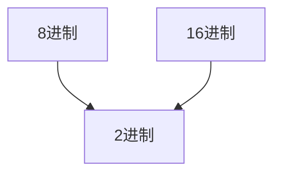

---
{"dg-publish":true,"permalink":"/Md Files/8进制16进制-->转2进制/","dgPassFrontmatter":true}
---

- [[Md Files/二进制\|二进制]]
- [[Md Files/其他进制-->10进制\|其他进制-->10进制]] 
- [[Md Files/10进制-->其他进制\|10进制-->其他进制]]  
- [[Md Files/2进制-->其他进制\|2进制-->其他进制]] 
- [[Md Files/8进制16进制-->转2进制\|8进制16进制-->转2进制]] 
- [[Md Files/运算符\|返回]]  
- ---

---
#### 8进制转2进制
- 8进制数`每1位`，转成对应的`一个3位的`二进制数
- `0b0000`-->`8,4,2,1` #⭐️ 
- **案例**：`0237`转`2进制`-->`0b10011111`
	- `2`-->010
	- `3`-->011
	- `7`-->111
- --
#### 16进制转2进制
- 16进制数`每1位`，转成对应的`一个4位的`二进制数
- `0b0000`-->`8,4,2,1` #⭐️ 
- **案例**：`0x23B`转`2进制`-->`0b001000111011`
	- `2`-->0010
	- `3`-->0011
	- `B(11)`-->1011