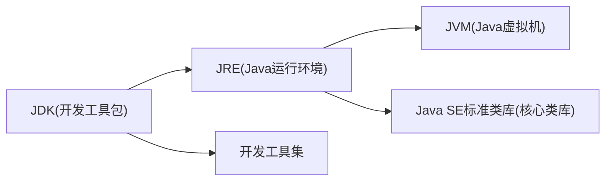

---
{"dg-publish":true,"permalink":"/Md Files/JDK/","dgPassFrontmatter":true}
---

- #### JDK(Java开发工具包)
	- 开发工具集
	- ==JRE== (Java运行环境)
		- [[Md Files/JVM\|JVM]] (Java虚拟机) 
		- Java 标准类库 (核心类库)

```mermaid
graph LR;
0["JDK(开发工具包)"]-->1["JRE(Java运行环境)"] & 开发工具集
1-->2["JVM(Java虚拟机)"] & 3["Java SE标准类库(核心类库)"]
```