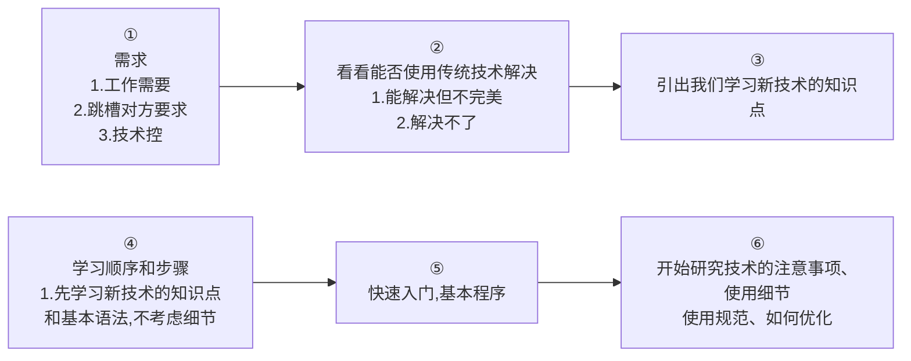
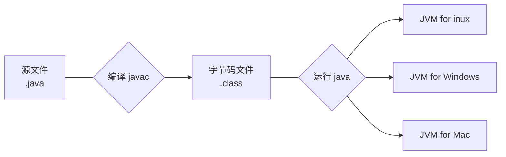
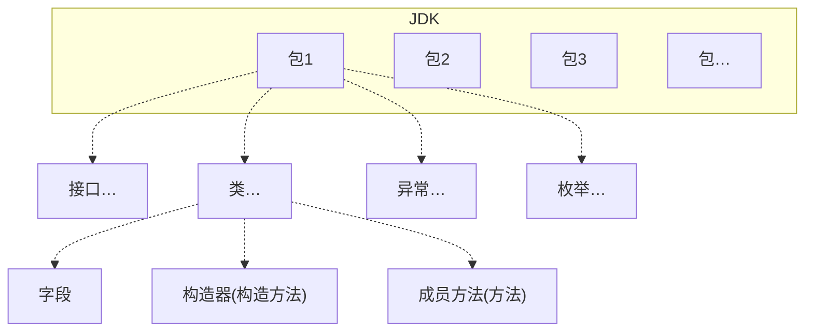

---
{"dg-publish":true,"permalink":"/Md Files/Java概述/","dgPassFrontmatter":true}
---

#### Java应用
- 大数据算法工程师
- Android开发
- 企业级应用
---
#### 如何快速学习

---
#### Java历史
- 什么是程序：==有序指令==的集合
- `.class` 为编译后的文件
- `.java` 为写程序的文件
---
#### Java特点
- 1、面向对象
- 2、健壮性的、强类型语言、异常处理、垃圾自动收集机制
- 3、[[跨平台性.canvas]]`.class`可以在多个平台运行
- 4、[[Md Files/解释型\|解释型]]语言
---
#### Sublime
- Java开发工具
	- IDEA
	- eclipse
	- Sublime (文本编辑器)
---
#### Java运行机制

- Java跨平台性的原因：[[Md Files/JVM\|JVM]] (包含于[[Md Files/JDK\|JDK]]里)
---
#### [[Md Files/JDK\|JDK]] 
- 下载和安装
---
#### 转义字符
- `\t`制表位，实现对齐功能
- `\n`换行符
- `\\`一个\
	- `\`表示转义
- `\"`一个"
- `\'`一个'
- `\r`一个回车 [空降](https://www.bilibili.com/video/BV1fh411y7R8?t=843.3&p=21) 
---
#### Java开发规范
- Java源文件的==基本组成部分==是类(class)
- main方法是固定的，是程序执行入口
- Java语言==区分大小写==
- Java方法由一条条语句组成，分号(`;`)必不可少
- 一个**源文件**中最多有一个public类，可以有其他类，其他类个数不限，但public类只能有一个
	- 编译后，==每一个类都对应一个==`.class`文件
- 如果**源文件**包含一个public类，则文件名==必须按该类名命名== 
	- ==公有类==的类名必须是==文件名称==
- 一个源文件中最多只能有一个public类。其他类个数不限，也可以将==main方法==写在==非public类==中，然后指定运行==非public类==，这样入口方法就是==非public==的main方法。[空降](https://www.bilibili.com/video/BV1fh411y7R8?t=656.3&p=19) 
---
#### 常见错误
- 1、文件名写错
- 2、公共类名与文件名不匹配
- 3、缺少分号、拼写错误、英文中文符号错误
- 4、其他错误
	- 业务逻辑错误
	- 环境错误
- [[Md Files/注释\|注释]] 
---
#### [[Md Files/Java代码规范\|JAVA代码规范]]
---
#### Java API
- [空降](https://www.bilibili.com/video/BV1fh411y7R8?t=250.9&p=46) 
- API：应用程序编程接口
- Java语言提供了大量基础类
---
#### Java类的组织形式

