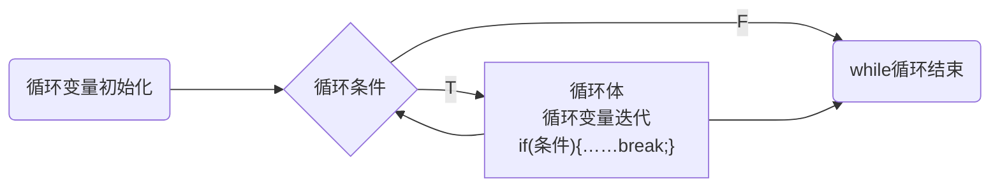

---
{"dg-publish":true,"permalink":"/Md Files/break/","dgPassFrontmatter":true}
---

- [空降](https://www.bilibili.com/video/BV1fh411y7R8?t=6.7&p=139) 
- 介绍：`break`语句用于终止某个语句块的执行，一般使用在`switch`或者循环(for while do-while`)中
```java
{
	……
	break;
	……
}
```


---
#### 跳转
- 1、break语句出现在多层嵌套的语句块中时，可以通过标签指明要终止的是哪一层语句块
- 2、标签的使用——使用标识符`需要满足标识符的命名规则`
	- [[Md Files/标识符命名规则和规范\|标识符命名规则和规范]]
```java
 for(){
	label1:
	for(){
		label2:
		for(){
			label3:
			break label2;
		}
	}
}
```
- ps：
	- 1、`break`语句可以指定退出哪层
	- 2、`label1`是标签，名字由程序员指定
	- 3、`break`后指定到哪个label就要退出到哪里
	- 4、在实际的开发中，尽量不要使用标签
	- 5、如果没有指定`break`，默认退出最近的循环体
- **案例**
```java
label1:
for(int j = 0; j < 4; j++){
label2:
	for(int i = 0; i < 10; i++){
		if(i == 2){
			break;
		}
		System.out.println("i=" + i);
	}
}
//i=0
//i=1 四组
```
