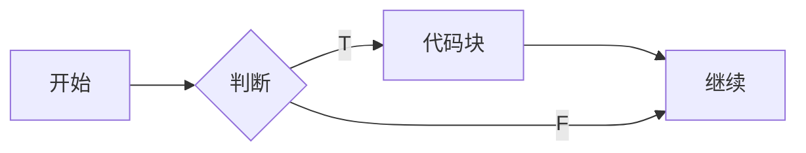
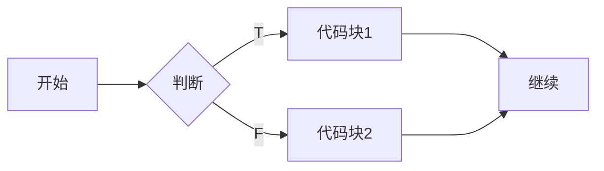
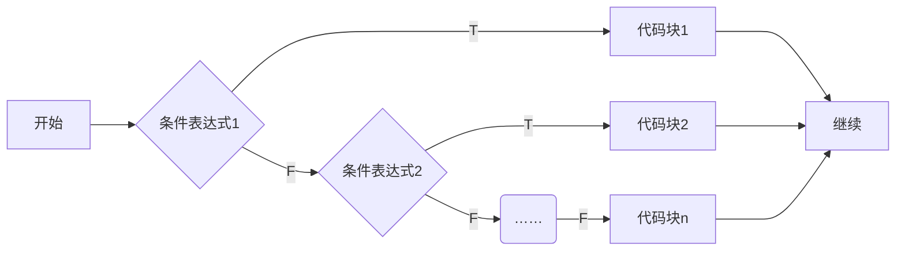
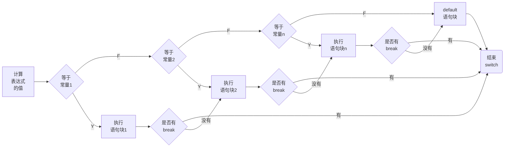

---
{"dg-publish":true,"permalink":"/md-files/if-else-switch/","dgPassFrontmatter":true}
---

- 让程序有选择的执行
- 分类：
	- 1、单分支
	- 2、双分支
	- 3、多分支
- ---
#### `if`单分支
```java
if(条件表达式){
	执行代码块;//可以有多条语句
}
```
- **说明**：当`条件表达式`为`true`时，会执行`{}`的代码，如果为`false`，则不执行。
	- 注意：如果`{}`中只有一条语句，则可以不用`{}`，但建议写上`{}`
- [[Md Files/if单分支案例01\|if单分支案例01]] 

---
#### `if`双分支
```java
if(条件表达式){
	执行代码块1;
}
else{
	执行代码块2;
}
```
- **说明**：当条件表达式成立时，即`执行代码块1`，否则`执行代码块2`
	-  注意：如果`{}`中只有一条语句，则可以不用`{}`，但建议写上`{}`
- [[Md Files/if双分支案例01\|if双分支案例01]] 

---
#### `if`多分支
```java
if(条件表达式){
	执行代码块1;
}
else if(条件表达式2){
	执行代码块2;
}
……
else{
	执行代码块n;
}
```
- 说明：
	- 1、当条件`表达式1`成立时，即执行`代码块1`
	- 2、如果`表达式1`不成立，才会去判断`表达式2`是否成立
	- 3、如果`表达式2`成立，就会执行`代码块2` 
	- 4、以此类推，如果所以的表达式都不成立，则执行`else的代码块`，注意只能有`一个执行入口`
- 特别说明：
	- 多分支可以没有`else`，如果所有的条件表达式都不成立，则一个`执行入口`都没有
	- 如果有`else`，所有所有的条件表达式都不成立，则默认执行`else代码块`

---
#### `if`嵌套分支
```java
if(){
	if(){
		if(){
			……
		}if else{
			……
		}else{
			……
		}
	}
}
```
- **说明**：
	- 不要嵌套超过三层
- [[Md Files/if嵌套分支案例\|if嵌套分支案例]] 
---
#### `switch`分支结构
- [空降](https://www.bilibili.com/video/BV1fh411y7R8?t=0.6&p=116) 
```java
switch(表达式){
	case 常量1 : //当……时
		语句块1;
		break;
	case 常量2 :
		语句块2;
		break;
	……
	case 常量n :
		语句块n;
		break;
	default :
		default语句块
		break;
}
```
- **说明**：常量是具体的值
	- 1、`switch`关键字，表示`switch`分支
	- 2、`表达式`对应一个值
	- 3、`case常量1`：当表达式的值等于`常量1`，就执行`语句块1` 
	- 4、`break`：表示退出`switch`
	- 5、如果和`case常量1`匹配，就执行`语句块1`，如果没有匹配，就继续匹配`case常量2` 
	- 6、如果一个都没有匹配上，执行`default` 
- **穿透**：`没有break`会穿透到`语句块2` 
	- 跟第一个匹配成功，如果没有break，会把所以的语句执行一遍。

- [[Md Files/switch分支结构案例\|switch分支结构案例]]  
- **细节**：
- 1、`表达式`数据类型，应和`case`后的常量类型一致，或者是可以`自动转成`可以互相比较的类型，比如输入的是`字符`，而常量是`int` 
- 2、`switch(表达式)`中表达式的返回值必须是`byte` `short` `int` `char` `enum`(枚举) `String` #⭐️ 
```java
double c = 1.1; 
switch(c){ //错误
	case 1.1 : //错误 
		System.out.println("ok3");
		break;
}
```
- 3、`case`子句中的值必须是**常量**或常量表达式，不能是**变量**
- 4、`default`子句是可选的，当没有匹配的`case`时，会执行`default`，如果没有`default`也没有匹配任何常量，则没有任何输出。
- 5、`break`语句在用来执行完一个`case`分支后使程序跳出`swtich`语句块，如果没有写，则程序按顺序执行，直到遇到下一个`break` 
- ---
#### `if` `switch` 比较
- 1、如果判断的具体数值不多，而且符合`byte` `short` `int` `char` `enum`(枚举) `String` 6种类型。虽然两个都可以使用，但建议使用`switch`语句
- 2、其他情况：对区间判断，对结果为`boolean`类型判断，使用`if` 