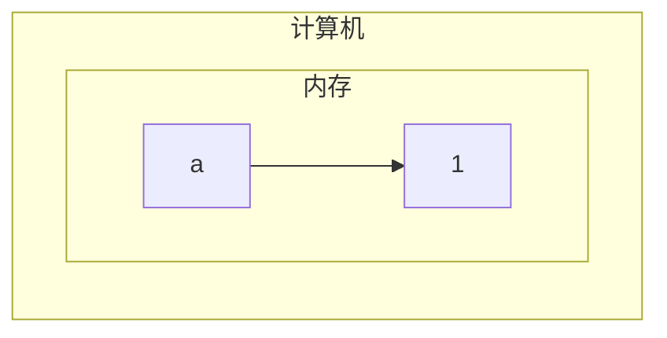

---
{"dg-publish":true,"permalink":"/md-files//","dgPassFrontmatter":true}
---


#### 为什么需要变量
- 变量是程序的基本组成单位 
- 变量的三个基本要素 
	- 类型——[[Md Files/数据类型\|数据类型]] 
	- 名称
	- 值
---
#### 变量的基本原理
```java
class Text{
	public static void main(String[] args){
		int a = 1;
		int b = 3;
		b = 89;
	}
}
```

---
#### 变量的基本使用

```java
class Text{
	public static void main(String[] args){
		int a = 1; //声明并赋值
		int b;
		b = 100; //先声明再赋值
	}
}
```
---
#### 变量的注意事项
- 变量表示的是内存的一个存储区域 (先有基本印象)
- 该区域有自己的名称和类型
- 变量必须先声明再使用，有顺序
- 变量的值可以变化，但需要在同一个类型变化
- 变量在同一[[Md Files/作用域\|作用域]]不能重名
- 变量三要素：变量名、值、数据类型
---
#### [[Md Files/数据类型\|数据类型]] #⭐️ 

---
#### [[Md Files/基本数据类型转换\|基本数据类型转换]] #⭐️ 
- [[Md Files/练习题-数据类型转换\|练习题-数据类型转换]] 
---
#### [[Md Files/String和基本数据类型转换\|String和基本数据类型转换]] 

