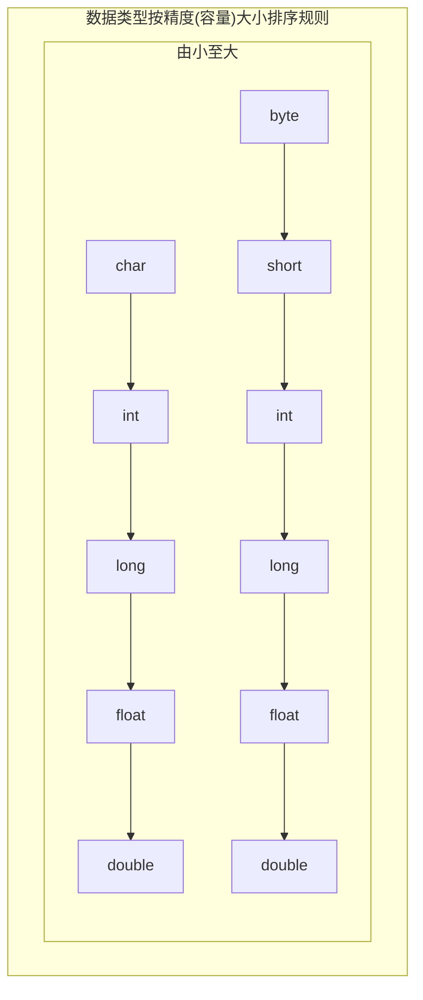

---
{"dg-publish":true,"permalink":"/md-files//","dgPassFrontmatter":true}
---

#### 自动类型转换——基本数据类型
- 精度小的类型自动转换为精度大的数据类型，称为自动类型转换
- 数据类型按精度(容量)大小排序

```java
int a = 'c'; //对， 第一条线
double d = 80; //对， 第二条线
```
---
#### 自动类型转换细节
- 1、**多种数据类型混合运算**，系统首先自动将==所有数据==转换成==容量最大==的数据类型，然后再进行计算
```java
int n1 = 10; //ok
float a1 = n1 +　1.1; // 1.1是double类型，不能自动转换成float
float a1 = n1 + 1.1F; //正确
```
- 2、逆着上述容量大小顺序进行自动转换时，会报错
- 3、**byte**, **short** 和 **char之间**==不会==相互自动转换
```java
byte b1 = 10; //对，当把具体数赋给byte时，会先判断该数是否在byte范围内，如果是就可以自动转换
int n2 = 1;
byte b2 = n2; //错，n2已经被定义类型了 
```
- 4、**byte**, **short**, **char** 三者可以计算，但==任一==参与运算时会首先转换为int类型
```java
byte b2 = 1; 
short s1 = 1;
short s2 = b2 + s1; //错，int无法自动转换为short
int s2 = b2 + s1; //对
byte b4 = b2 +ｂ3; //错 ， b2 + b3 ==>int
```
- 5、**boolean**类型不参与类型的自动转换 
- 6、**自动提升原则**：表达式结果的类型自动提升为 操作数中最大的类型
```java
byte b4 = 1;
short s3 = 100;
int num200 = 1;
double num300 = 1.1;
double num500 = b4 + s3 + num200 + num300; //结果是duble
```
---
#### 强制转换——基本数据类型
- 造成精度的损失，格外要注意 
```java
int n1 = (int)1.9;
System.out.println("n1=" + n1); // 结果为1
int n2 = (byte)2000;
System.out.println("n2=" + n2); // 结果为-48
```
---
#### 强制转换细节
- 1、数据由 大——»小 要进行强制转换
- 2、强制转换只针对==最近==的操作数有用，可用`()`扩住
- 3、char类型可以保存int的常量值，但不能保存int的变量值，需要强转
```java
char c1 = 100;//ok
int m = 100;//ok
char c2 = m;//error
char c3 =(char)m;//ok
System.out.println(c3);//100对应的字符
```
[[Md Files/练习题-数据类型转换\|练习题-数据类型转换]] 