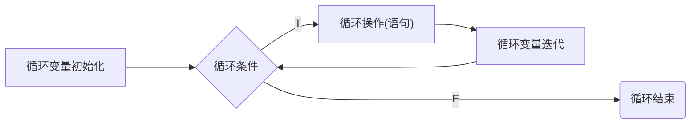
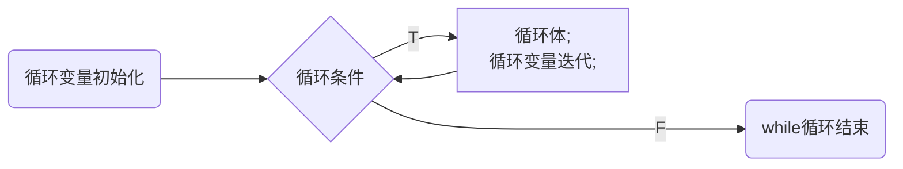
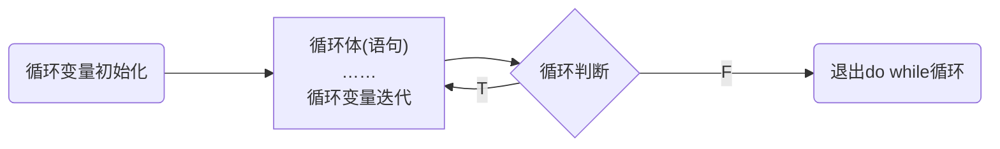

---
{"dg-publish":true,"permalink":"/Md Files/循环控制(for, while, do while, 多重循环)/","dgPassFrontmatter":true}
---

- [空降](https://www.bilibili.com/video/BV1fh411y7R8?t=2.8&p=122) 
- **基本介绍**：让代码循环执行
- ---
#### `for`循环控制
```java
for(循环变量初始化;循环条件;循环变量迭代){
	循环操作(可以多条语句);
}
```
- **说明**：
	- 1、`for`关键字，表示循环控制
	- 2、`for`有四要素：
		- 1、循环变量初始化
		- 2、循环条件
		- 3、循环操作
		- 4、循环变量迭代
	- 3、循环操作可以有`多条语句` 
	- 4、如果循环操作只有一条语句，可以省略`{}`，但建议不要省略

- 注意事项：
	- 1、循环条件是一个布尔值的表达式
	- 2、`for(;判断循环条件;)`中的初始化和变量迭代可以写到其他地方，但两边的`;`不能省略
		- **ps**：写在括号里的变量只能在`for 循环`中使用 #⭐️ 
	- 3、循环变量`初始值`可以有多条初始化语句，但要求类型一样，并且中间用`,`隔开，循环变量迭代也可以有多条语句，中间用`,`隔开。
- [[Md Files/for循环控制案例\|for循环控制案例]] 
---
#### `while`循环控制
```java
循环变量初始化
while(循环条件){
	循环体(语句);
	循环变量迭代;
}
```
- 说明：`while`循环也有四要素，基本功能同`for`一样

- **细节**：
	- 循环条件返回值为`boolean`
	- `while`循环是先判断再执行语句
- [[Md Files/while循环控制案例\|while循环控制案例]] 
- --
#### `do while`循环控制
```java
循环变量初始化;
do{
	循环体(语句);
	循环变量迭代;
}while(循环条件);
```
- 说明：
	- `do while`是关键字
	- 也有循环四要素
	- 先执行，再判断，也就是说，一定会执行一次
	- 最后有一个分号`;` 
	- `while`和`do while`区别：**要账**

- [[Md Files/do while循环控制案例\|do while循环控制案例]] 
- ---
#### 多重循环控制 #⭐️⭐️⭐️  
- [空降](https://www.bilibili.com/video/BV1fh411y7R8?t=2.1&p=134) 
```java
for(){
	for(){
		for(){
			……
			}
		}
	}
}
```
- 1、将一个循环放在另一个循环体内，`for, while, do while`都可作内或外层循环，
	- 一般建议两层，不要超过三层
- 2、嵌套循环就是把内层循环当成外层循环的循环体，当内层循环的条件为false，才会跳出内层循环，才可结束外层的当次循环开始下一轮循环
- 3、当外层循环次数为$m$次，内层为$n$次，内层循环实习执行次数为$m\times n$次
```java
for(int i = 1; i <= 7; i++){
	for(int j = 1; j <= 2; j++){
		System.out.println("ok~~")//打印7 * 2 =14次 
	}
}
```

