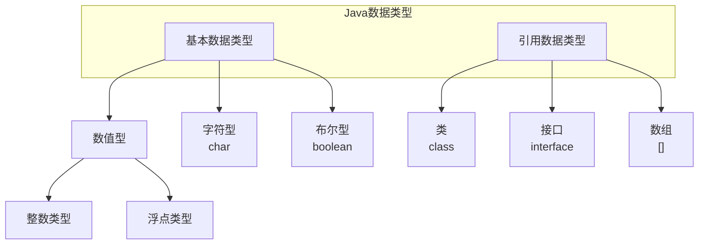
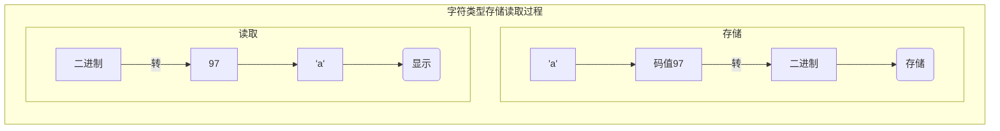
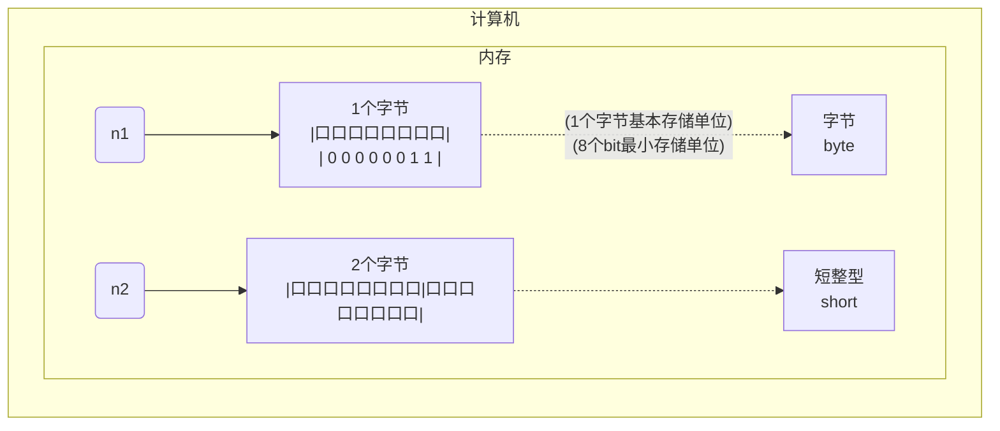

---
{"dg-publish":true,"permalink":"/Md Files/数据类型/","dgPassFrontmatter":true}
---

#⭐️ 
- [空降](https://www.bilibili.com/video/BV1fh411y7R8?t=71.6&p=41) 
#### 变量的数据类型
- 每一种数据都定义了明确的数据类型，在内存中分配了不同大小的内存空间(字节)
- 数据类型可分为以下两大类型



| 关键字         | 数据类型      | bit   | ==内存== | 名称  | 备注                                                   |
| ----------- | --------- | ----- | ------ | --- | ---------------------------------------------------- |
| [[Md Files/byte\|byte]]    | 整数类型      | 8bit  | 1个字节   | 字节  | 范围：$-128至127$                                        |
| [[Md Files/short\|short]]   | 整数类型      | 16bit | 2个字节   | 短整型 | 范围：$-2^{15}至2^{15}-1即$$-32768至32767$                 |
| [[Md Files/int\|int]]     | 整数类型      | 32bit | 4个字节   | 整型  | 范围：$-2^{31}至2^{31}-1$<br>即是：$-2147483640至2147483647$ |
| [[Md Files/long\|long]]    | 整数类型      | 64bit | 8个字节   | 长整型 | 范围：$-2^{63}至2^{63}-1$                                |
|             |           |       |        |     |                                                      |
| [[Md Files/float\|float]]   | 浮点类型      | 32bit | 4个字节   | 单精度 |                                                      |
| [[Md Files/double\|double]]  | 浮点类型      | 64bit | 8个字节   | 双精度 |                                                      |
|             |           |       |        |     |                                                      |
| [[Md Files/char\|char]]    | 字符类型      |       | 1个字节   |     | 单字符，'a'                                              |
| [[Md Files/String\|String]]  | ==字符串类型== |       |        |     | 不是基本数据类型，而是一个类                                       |
|             |           |       |        |     |                                                      |
| [[Md Files/boolean\|boolean]] | 布尔类型      |       |        |     | 1 存放true, false                                      |

---
#### 整数类型说明
- Java整数类型有固定的的范围和字段长度，以保证可移植性
- Java整型常量默认为int型，声明==long型==常量后必须加`l`或`L` 
- Java程序中常用变量为int型，除非不足以表示大数
- bit是计算机中最小的存储单位。byte是计算机中最基本的存储单元
	- 1byte = 8bit——[[Md Files/二进制\|二进制]] 
---
#### 浮点类型说明
- 浮点数的存放形式：浮点数 = ==符号位== + 指数位 + 尾数位
- 尾数部分可能丢失，造成精度损失 (==小数都是近似值==)
- 固定字段+固定范围=可移值性
- 默认是double，声明==float型==后必须加`f`或`F`——[空降](https://www.bilibili.com/video/BV1fh411y7R8?t=119.0&p=44) 
	- double型后可以加上`d`或`D` 
```java
float num1 = 1.1;   //错
float num2 = 1.1F;  //对
double num3 = 1.1;  //对
double num4 = 1.1F; //对 小的能放进大的里
double num5 = .123 //等价于0.123
```
- 科学计数法：$5.12e2=5.12\times10^{2}$    $5.12e{-2}=5.12\times10^{-2}$
	- 计算前有double类型，结果会保留double类型
- ==通常情况==下使用==double==类型
- ==浮点数的陷阱==——[空降](https://www.bilibili.com/video/BV1fh411y7R8?t=112.9&p=45) 
	- **重要的使用点**——对小数(==尤其是进行运算后的==)进行==相等判断==时要小心
	- 应该是以两个数的差值的绝对值，在某个精度范围内判断
```java
double num11 = 2.7;    //2.7
double num12 = 8.1/3;  //接近2.7的小数
if(num1 == num2 ){
	System.out.println("相等"); //不能这么判断
}
if(Math.abs(num11 - num12)<0.000001){ 
	System.out.println("相等");//应该这么判断,差值小到一个精度，认为相等
}
```
- 直接赋的值是可以判断相等的
---
#### 字符类型说明
- char的本质是一个**整数**，默认对应了unicode字符编码的自负
	- 要输出对应的数字时，使用(int)字符
```java
char c3 = '\t'; //“\t”构成一个字符，“\”是转义字符
char c4 = 97; //字符类型可以直接存放一个数字
System.out.println(c4);  //输出c4时，会输出97所表示的字符——>编码为a

char c5 = '韩';
System.out.println((int)c5); //输出为  38889
char c6 = 38889;
System.out.println(c6); //输出为  韩 

char c6 = 'b' +　１;//98+1==>99
System.out.println((int)c5); //99
System.out.println(c5); //99-对应的字符->c (ASCII码表)
```

- 字符和码值的对应关系由字符编码表决定，是规定好的
- 常用编码表 

| 码表      | 内存     | 备注                                    |
| ------- | ------ | ------------------------------------- |
| ASCII码表 | 1个字节   |                                       |
| Unicode | 2个字节   | 字母和汉字统一占2个字节                          |
| UTF-8   | 1or3字节 | 在Unicode基础上改进，字母使用1个字节，汉字使用3个字节，最大6字节 |
| GBK     | 1or2字节 | 字母1个字节，汉字2个字节                         |
| GB2312  |        | 表示的汉字比GBK少                            |
| BIG5码   |        | 繁体字编码、台湾、香港                           |

---
#### 布尔类型
- 基本介绍
- 使用细节
	- 不可以使用0或非0的数代替false和true

---
#### 内存存放
```java
byte n1 = 3;
short n2 = 3;
```
